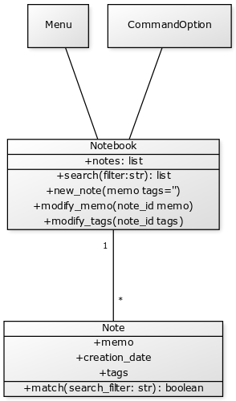

# python-notebook
A notebook to store notes(short memos). Each note can have tags added for easy querying and a search function. 

## Project Design
We'll implement a command line menu interface, from this command line interface, you can create new note, search text or tags in the current note, modify a note or show current notes.

## Class UML


## Project Structure
```bash
python-notebook:
    notebook.py
    menu.py
    command_option.py
```

## How to Run
```bash
$ pyhton command_option.py
```
